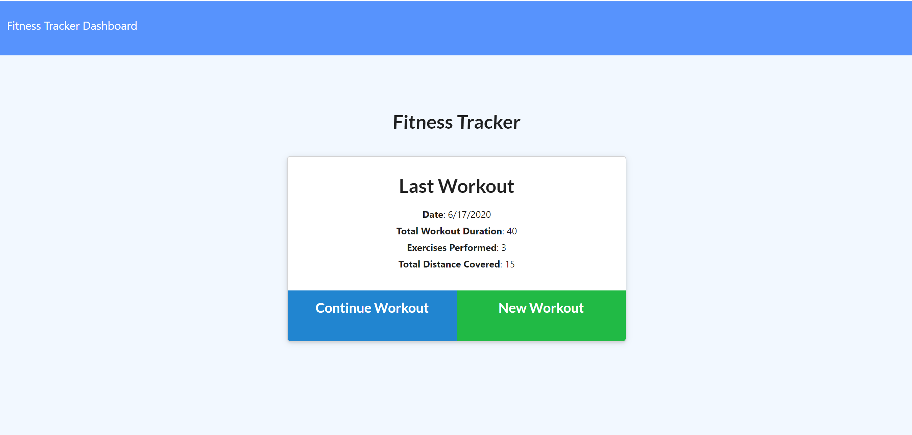
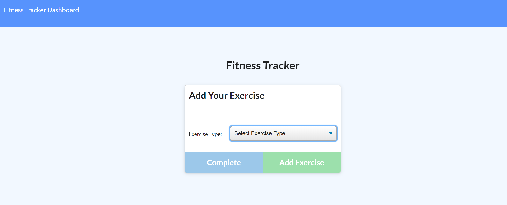
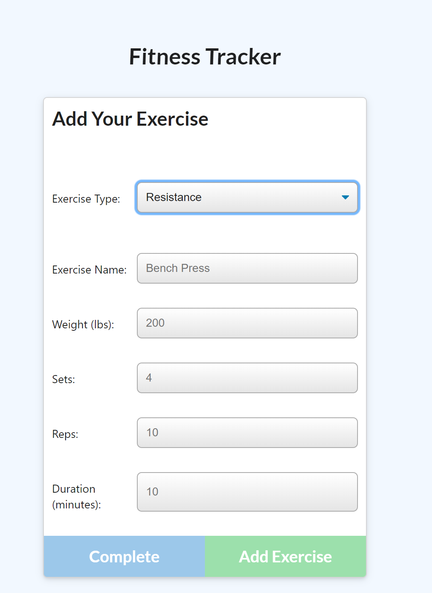
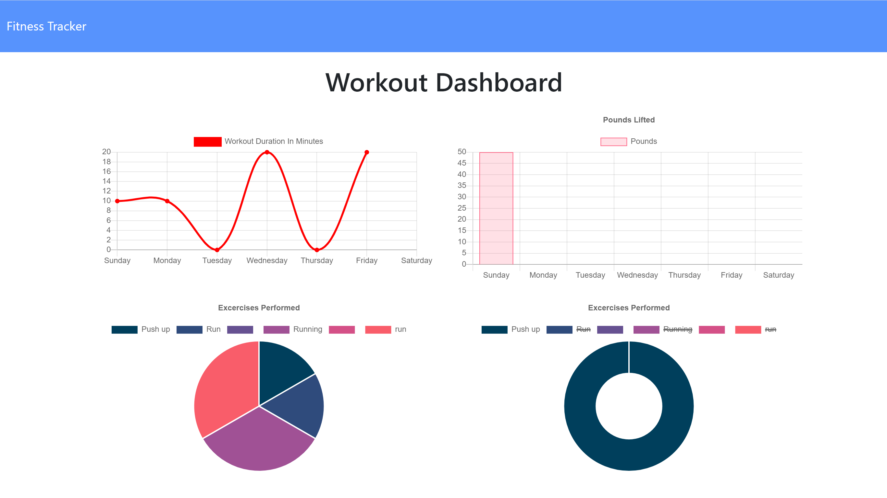

# Workout Tracker

Tracker your fitness goals quicker with this 'Workout Tracker' application.

## Link to Application

Follow [this link](https://peaceful-bastion-78213.herokuapp.com/) to view the application.

## Screenshots

### Desktop

## Getting Started

Download or clone the repo, then using a CLI run the following:

npm install

Then run the application by typing node run start into the CLI:

node run start
Then use your preferred browser to access the App.

## Running the Application

The user should be able to:

  * Add exercises to a previous workout plan.

  * Add new exercises to a new workout plan.

  * View the combined weight of multiple exercises on the `stats` page.

## Built With

- Node.js
- Express
- Mongoose

## Authors
- **Prakriti Rajbhandari** - [PrakritiRajbhandari](https://github.com/PrakritiRajbhandari)

## License

This project is licensed under the MIT License - see the [LICENSE.txt] file for details

## Acknowledgments

- Billie Thompson - [PurpleBooth](https://gist.github.com/PurpleBooth) - [README.md](https://gist.github.com/PurpleBooth/109311bb0361f32d87a2) and [CONTRIBUTING.md](https://gist.github.com/PurpleBooth/b24679402957c63ec426) templates.
